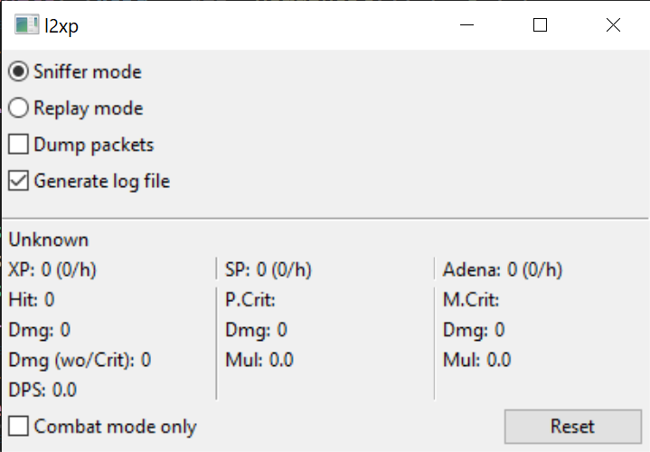

# OpenGLLayeredWindow

This is the l2xp project.

Disclaimer : This project is provided as-is only for educational purpose. The project won't compile because some dependencies are not included.

This program is a tool for the now defunct Lineage II MMORPG. It captures and decyphers the packets sent from the server to the client to display some metrics (xp/seconds, gold/seconds, etc...).

Dependencies :
- boost
- WinPCap or NPCap

# Building

The project won't build but you can explore the sources with the provided Visual Studio solution.
You can also generate a project for the IDE of your choice supported by premake5 :
`premake5 generator_of_choice --to=optional_out_of_source_directory`

# Licensing

This is free and unencumbered software released into the public domain.

Anyone is free to copy, modify, publish, use, compile, sell, or
distribute this software, either in source code form or as a compiled
binary, for any purpose, commercial or non-commercial, and by any
means.

In jurisdictions that recognize copyright laws, the author or authors
of this software dedicate any and all copyright interest in the
software to the public domain. We make this dedication for the benefit
of the public at large and to the detriment of our heirs and
successors. We intend this dedication to be an overt act of
relinquishment in perpetuity of all present and future rights to this
software under copyright law.

THE SOFTWARE IS PROVIDED "AS IS", WITHOUT WARRANTY OF ANY KIND,
EXPRESS OR IMPLIED, INCLUDING BUT NOT LIMITED TO THE WARRANTIES OF
MERCHANTABILITY, FITNESS FOR A PARTICULAR PURPOSE AND NONINFRINGEMENT.
IN NO EVENT SHALL THE AUTHORS BE LIABLE FOR ANY CLAIM, DAMAGES OR
OTHER LIABILITY, WHETHER IN AN ACTION OF CONTRACT, TORT OR OTHERWISE,
ARISING FROM, OUT OF OR IN CONNECTION WITH THE SOFTWARE OR THE USE OR
OTHER DEALINGS IN THE SOFTWARE.

For more information, please refer to <https://unlicense.org>
